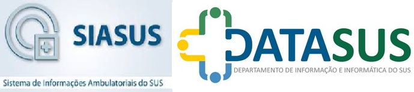

**SIA – Faturamento Ambulatorial** 💵

O SIA é o sistema responsável pelo processamento das informações de atendimentos ambulatoriais realizados por prestadores públicos e privados contratados ou conveniados ao SUS.
As informações são captadas por meio dos seguintes instrumentos de registro:

•	APAC

•	RAAS

•	BPA-I / BPA-C

•	SISCAN

As automações desenvolvidas neste repositório têm como objetivo a otimização das atividades dentro deste sistema que, normalmente, demandariam tempo e esforço manual.
